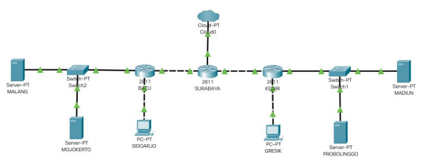
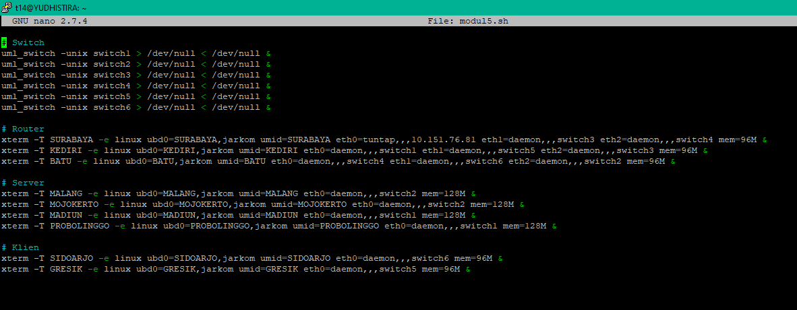
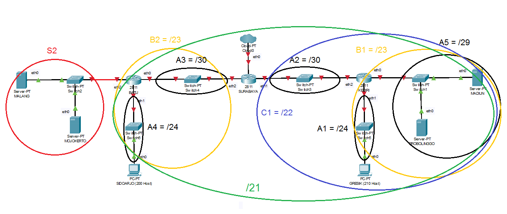
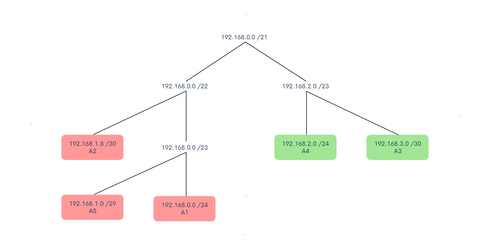
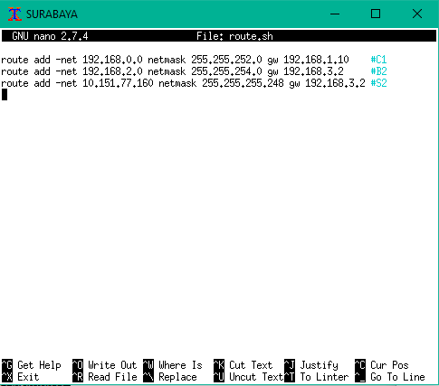
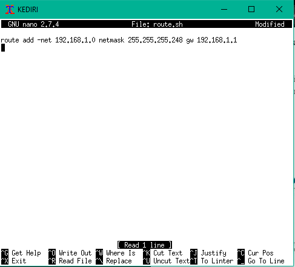

# Laporan Resmi Praktikum Komunikasi Data dan Jaringan Komputer Modul 5 Kelompok T14

## Anggota Kelompok:

1. Hisyam Zulkarnain F – 05311840000019
2. Muhamad Rifaldi - 05311840000022\

## Soal
Setelah kalian mempelajari semua modul yang telah diberikan, Bibah ingin meminta bantuan untuk
terakhir kalinya kepada kalian. Dan kalian dengan senang hati mau membantu Bibah.

**(A)** Tugas pertama kalian yaitu membuat topologi jaringan sesuai dengan rancangan yang diberikan
Bibah seperti dibawah ini :
  

**Keterangan :** 
    
    SURABAYA diberikan IP TUNTAP  
    MALANG merupakan DNS Server diberikan IP DMZ  
    MOJOKERTO merupakan DHCP Server diberikan IP DMZ  
    MADIUN dan PROBOLINGGO merupakan WEB Server  
    Setiap Server diberikan memory sebesar 128M  
    Client dan Router diberikan memori sebesar 96M  
    Jumlah host pada subnet SIDOARJO 200 Host  
    Jumlah host pada subnet GRESIK 210 Host  

**(B)** karena kalian telah mempelajari Subnetting dan Routing, Bibah meminta kalian untuk membuat topologi tersebut menggunakan teknik CIDR atau VLSM. Setelah melakukan subnetting, **(C)** kalian juga diharuskan melakukan routing agar setiap perangkat pada jaringan tersebut dapat terhubung.

**(D)** Tugas berikutnya adalah memberikan ip pada subnet SIDOARJO dan GRESIK secara dinamis
menggunakan bantuan DHCP SERVER (Selain subnet tersebut menggunakan ip static). Kemudian
kalian mengingat bahwa kalian harus setting DHCP RELAY pada router yang menghubungkannya,
seperti yang kalian telah pelajari di masa lalu.

**(1)** Agar topologi yang kalian buat dapat mengakses keluar, kalian diminta untuk mengkonfigurasi
SURABAYA menggunakan iptables, namun Bibah tidak ingin kalian menggunakan
MASQUERADE.

**(2)** Kalian diminta untuk mendrop semua akses SSH dari luar Topologi (UML) Kalian pada server
yang memiliki ip DMZ (DHCP dan DNS SERVER) pada SURABAYA demi menjaga keamanan.

**(3)** Karena tim kalian maksimal terdiri dari 3 orang, Bibah meminta kalian untuk membatasi DHCP
dan DNS server hanya boleh menerima maksimal 3 koneksi ICMP secara bersamaan yang berasal dari
mana saja menggunakan iptables pada masing masing server, selebihnya akan di DROP.

Kemudian kalian diminta untuk membatasi akses ke MALANG yang berasal dari SUBNET
SIDOARJO dan SUBNET GRESIK dengan peraturan sebagai berikut:  

● **(4)** Akses dari subnet SIDOARJO hanya diperbolehkan pada pukul 07.00 - 17.00 pada hari Senin
sampai Jumat.  
● **(5)** Akses dari subnet GRESIK hanya diperbolehkan pada pukul 17.00 hingga pukul 07.00 setiap
harinya. Selain itu paket akan di REJECT. 

Karena kita memiliki 2 buah WEB Server, **(6)** Bibah ingin SURABAYA disetting sehingga setiap
request dari client yang mengakses DNS Server akan didistribusikan secara bergantian pada
PROBOLINGGO port 80 dan MADIUN port 80.

**(7)** Bibah ingin agar semua paket didrop oleh firewall (dalam topologi) tercatat dalam log pada setiap
UML yang memiliki aturan drop.

Bibah berterima kasih kepada kalian karena telah mau membantunya. Bibah juga mengingatkan agar
semua aturan iptables harus disimpan pada sistem atau paling tidak kalian menyediakan script sebagai
backup.

## Jawaban
Pengerjaan menggunakan teknik CIDR (Classless Inter Domain)

**(Soal A)**
- Buat file `topologi.sh` dengan isi sebagai berikut:

**(Soal B)**  
CIDR (Classless Inter Domain Routing) dengan langkah sebagai berikut:
- Buat pembagian subnet kemudian hitung subnet pada tiap bagian sebagai berikut:

    - Gabungkan Host A1 - A2 & A5 - A6 hingga membentuk Host baru yaitu B1 & B2 dengan Subnet Mask /23.
    - Kemudian gabungkan Host B1 - A3 & B2 - A4 hingga membentuk Host baru yaitu C1 & C2 dengan Subnet Mask /22.
    - Terakhir gabungkan Host C1 - C2 hingga membentuk Host baru yaitu D1  dengan Subnet Mask /21.

- Hitung IP Address yang dibutuhkan (Jumlah Host, Router, dan Server). Pada soal ini ada kurang lebih 422 IP Address maka subnet yang dipakai untuk membuat pohon IP yaitu subnet 21. 

| Nama | Jumlah IP | Netmask |
|--|--|--|
| A1 | 3 | /29 |
| A2 | 201 | /24 |
| A3 | 2 | /30 |
| A4 | 2 | /30 |
| A5 | 211 | /22 |
| A6 | 3 | /29 |

- Buat pohon IP berdasarkan pembagian subnet yang ada pada topologi seperti gambar berikut ini:

**(Soal C)**
- Routing dilakukan dengan mengisi file `/etc/network/interfaces`.
- Kemudian isi file route.sh pada uml SURABAYA, KEDIRI, dan BATU.

